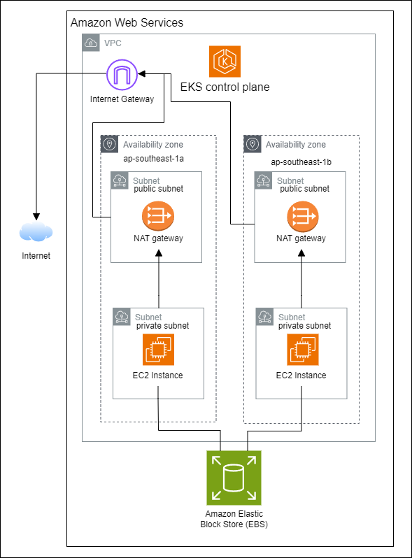

# Design and deploy an AWS EKS Cluster

## Infrastructure Diagram

## Description

Deploying Amazon Elastic Kubernetes Service (EKS) with 1 node group with 2 minimum worker nodes deployed across 2 availability zones (AZ).

### Worker Nodes

The worker nodes have a disk size of 50 GB and of a general purpose instance type (t3.small), which is a cost effective option for workloads that can grow.
They are deployed in 2 separate subnets. The 2 subnets are deployed in 2 different AZ, ap-southeast-1a and ap-southeast-1b. This ensures that the worker nodes will be highly available and accessible even if one of the zones is down.

### VPC

A VPC is created with two private and two public subnets (one pair in each AZ where the worker node is deployed) with 2 availability zones that allows for high availability.

The EKS control plane is also automatically created when the cluster is set up within the defined VPC's cidr block.

Private subnets are used for better security so that the traffic is routed through the NAT gateway in the public subnets before hitting the internet.

The /16 subnet mask is chosen as it comprises of sufficient IP addresses (65,536) to allocate to all the subnets as well as worker nodes.

NAT gateways are also added and ensured that there is one created per AZ. This allows the worker nodes in each AZ to be able to route traffic to the internet through the NAT gateway in their own AZ.

### Subnets

Subnets is used to influence how traffic is routed within VPC and to the internet. Both public and private subnets is used in this deployment to allows better security and cost-efficacy. Having the subnets across 2 different AZ allows for maintaining high availability.

In each private subnet, the worker nodes are deployed. These nodes are connected to the public subnets and able to communicate with various services within the VPC. The separation of private and public subnets brings various benefits:

- Placing worker nodes in private subnets shield them from direct access to the internet and reducing attack surface.
- Worker nodes usually requires limited internet access for certain tasks such as pulling container images or communicating with external services. These tasks can be routed through a NAT Gateway in the public subnet in each AZ to the internet. This save costs and provide better control over outgoing traffic.
- By having both public and private subnets in each AZ, application and its components that are residing in each private and public subnets can continue to function even if one AZ experiences an outage.

### Route Tables

Route tables are added to define the allowed routes for private and public subnets within and outside the EKS cluster.

Two route tables are created, one for private subnet and one for public subnet.

For the public subnet table, a route is created to allows the public subnets to access the internet. This table is associated with both public subnets across two AZs.

For the private subnets route table, the route created is to allow private subnets to access internet only via the NAT gatway. This table is also associated with both private subnets across two AZs.

The design considerations allows public subnets access to the internet via the Internet Gateway while preventing private subnets from directly accessing the internet.

### Security Groups

Security groups are added to the EKS cluster to control the traffic to and from worker nodes and the EKS control plane.

One security group is created for EKS control plane. This security group allows the control plane to communicate with the worker nodes.

Another security group is also created for the EKS worker nodes to allow worker nodes to communicate with each other internally and be able to access necessary resources such as the Elastic Block Store (EBS) and the control plane.

The creation of 2 separated security groups allow the differentiation of traffic rules between worker nodes and EKS control plane. The rules also limited the ports that can be communicated only to what is necessary.

### Network Access Control Lists (NACL)

NACL are used to control traffic at the subnet level for both private and public subnets.

For this cluster, various access control rules are added on the to private subnets so as to allow minimal required traffic only. The rules allow inbound and outbound traffic to and from the VPC, but deny all inbound and outbound traffic to and from the internet.

This prevent the private subnets to be able to access to the internet as well even if the security groups or route tables fail.

### Identity and Access Management (IAM) Roles and Policies

Various IAM roles are created to manage the access control to the EKS cluster. Necessary policies are also attached to the roles such that the worker nodes are able to communicate with the EKS cluster as well as for the cluster to access other AWS services.

An IAM role is created for the worker nodes which allow them to assume the required roles laid out in the policy. An instance profile is also added to act as a container for the IAM role.

The following policies are attached to the IAM role for worker nodes:

- **AmazonEKSWorkerNodePolicy.** This policy is a predefined IAM policy by AWS to provide permissions required for Amazon EKS worker nodes such as joining the cluster or retriving information about the cluster. This is added to allow worker nodes to connect to the EKS control plane smoothly.

- **AmazonEKS_CNI_Policy.** This policy is a predefined IAM policy by AWS to provide permissions required to manage networking related actions, such as assigning IP addresses from the VPC cidr block, allowing the worker nodes to assign IP addresses for instances based on the available addresses from the VPC cidr block.

A custom IAM policy is also created for EBS storage. In the policy, various permissions such as creating volume, creating snapshots and modifying volues are added. These permissions allow the worker nodes to utilise EBS storage and store persistent data. This policy is also attached to the IAM role for worker nodes.

To allow interaction with various AWS services such as CloudWatch and S3, a custom IAM policy for the cluster is created with the necessary permissions added. If there are other AWS services required, more permissions can be added to this cluster policy. Currently, it is kept at the minimal with just these two examples to reduce the number of unnecessary permissions. This IAM policy is attached to the IAM role as well.

### Storage

To enable the EC2 instances to be able to store their data in a persistent storage, an Amazon Elastic Block Store (EBS) is also added to the cluster. They are connected to the worker nodes to enable them to use it as persistent storage.

The EBS volume is only available in one zone (ap-southeast-1a). However, EBS snapshots is also used to back up these critical data.

**gp2** is also selected as the volumes for general purpose workloads for their cost effective performance.

### Outputs

Output variables that are useful in managing the EKS cluster is outputted when the terraform is applied. These include:

- EKS Cluster Name
- VPC ID
- Worker Node Role ARN
- Public Subnets
- Security Groups

Route tables and private subnets are not outputted as they often contain sensitive information such as route destinations and internal network structure. They also have limited usefulness even when being outputted.

## Assumptions for the EKS cluster set up

1. There is a load balancer installed into the cluster to assist to balance the worker nodes such that the traffic will not be skewed.
2. Number of IP addresses declared within the VPC is sufficient for the subnets for additional nodes even if there are scaled in the future.
3. Latency is negligible for communication across AZs, or worker nodes can be deployed in the same AZs if the communication require lower latency.  
4. EBS volumes attached to the EKS cluster is encrypted at rest, ensuring that the worker nodes' storage is protected.
5. EBS volumes are available for both the worker nodes across different AZs, the availability can be either direct access to the EBS storage or its snapshots.
6. There is an Internet connection for deployment and pulling of the necessary resources to deploy the cluster.

## Deployment

### Prerequisites

1. You have an AWS account ready with AWS CLI installed on your computer.
2. You have Terraform CLI installed on your computer.
3. The region to deploy the cluster is in Asia Pacific (Singapore) ap-southeast-1 in AWS.
4. You have an Internet connection to Terraform Providers Registry and AWS.

### Steps

1. Configure the AWS CLI with access credentials to your AWS account. This allows your deployment to be deployed directly onto AWS in further steps.

    - Command: `aws configure`
    - Preparation: AWS Access Key ID, Secret Access Key, Region (ap-southeast-1)

2. Create a directory to store all the terraform files. (deploy-eks-cluster)

3. Create various files that contain the configurations required to set up the cluster as well as the required VPC.

    - *main.tf* : Contain all information required to set up the terraform code, provider settings etc.

    - *variables.tf* : Contain the common variables that are used in various other configuration files. This allows the value of the variables to be centrally managed.

    - *eks-cluster.tf* : Contain the information about the EKS cluster, including number of private subnets, number of worker nodes. Additional security groups that are created in `security_groups.tf` is also linked to the cluster via *cluster_additional_security_group_ids*.

    - *VPC.tf* : Contain the information on the cidr blocks, availability zones, private and public subnets. The *enable_dns_support* and *enable_dns_hostnames* are enabled to allow each instance created to have a DNS name and IP address assigned automatically.

    - *routes.tf* : Contain the information on the route tables for public and private subnets. The code shown is commented as these are included in the terraform module for aws vpc (terraform-aws-modules/vpc/aws)

    - *roles.tf* : Contain the information on all the incoming and outgoing traffic rules for the control plane and worker nodes.

    - *nacl-config.tf* : Contain the information on all inbound and outbound traffic rules at the subnet level.

    - *roles.tf* : Contain the information for all he IAM roles and policies used for the worker nodes in order to ensure that they are permissioned to access certain resources.

    - *nat_gateway.tf* : Contain the information for creating a nat gateway for each AZ. The code is commented as these are included in the terraform module for aws vpc (terraform-aws-modules/vpc/aws)

    - *ebs.tf* : Contain information on the EBS volume to be used by the EKS cluster

    - A directory with *pvc.yaml* and *storageclass.yaml* is also required. They contain various configurations required by the EBS volume in order to attache to the EKS cluster.

    - *outputs.tf* : Contain information to be outputted after the cluster is set up by Terraform.

    > You can clone the various required code files in this GitHub repository to set up the EKS Cluster.

4. Open a cmd window in the directory where all your files reside.

5. Run `terraform init` to initialize terraform with all the providers.

6. Run `terraform validate` to validate the configuration.

7. Run `terraform plan` to plan the deployment, allowing you to see what terraform will be deploying before it is applied.

8. Run `terraform apply -target aws_security_group.eks_control_plane_sg` and `terraform apply -target aws_security_group.eks_worker_sg` first to create the necessary security groups to be added prior to creating the cluster.

9. Run `terraform apply` to apply and create all the necessary VPC, subnets, security groups, eks cluster and worker nodes. Once the process is completed, Terraform will output the cluster information.

10. Congratulations! You have deployed an AWS EKS cluster successfully!

(Optional) Run `kubectl get nodes` to check that your worker nodes are deployed correctly and you are able to see them in different availability zones (`ap-southeast-1a` and `ap-southeast-1b`)

(Optional) Verification of your cluster: Ssh into the worker nodes and check that you can `ping google.com` to verify internet access, as well as `ping <private-ip-of-other-instance>` to verify that you can communicate with other nodes.
